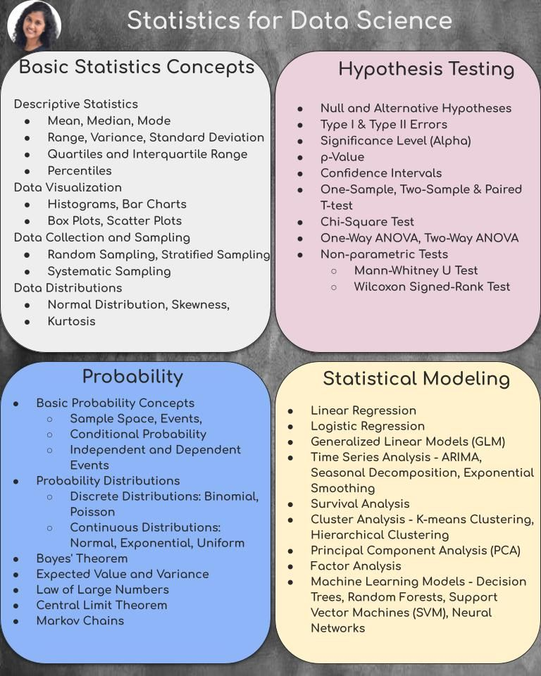

# ML-Prep-2024

Comprehensive resources and practice problems to prepare for Machine Learning interviews and exams in 2024. Includes theory notes, coding exercises, and project examples covering key topics in ML and Data Science.

## [Neural Network Concepts](https://ml-cheatsheet.readthedocs.io/en/latest/nn_concepts.html)

- **Neuron, Synapse, Weights, Bias, Layers, Activation Functions**
- Layers (Input, Hidden, and Output Layer)**
  - 
  -  <!-- Example image URL -->
Back Propagation 
--- 

-> RAG pipeline / Prompting Technique
-> Machine Learning Algorithms in depth
-> ONNX / Quantization in Depth . and article related to sbert ... and performance impact

statistics
